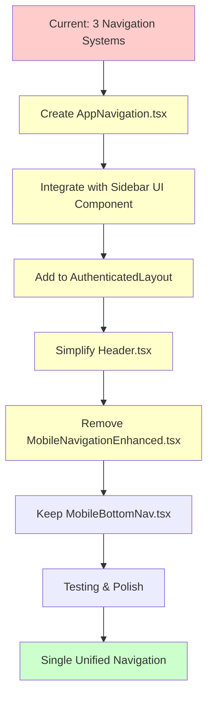

# Navigation Architecture: Current vs Proposed

## Current State (3 Navigation Systems)

### Desktop Navigation (Header.tsx - 1,168 lines)
```
┌─────────────────────────────────────────────────────────────┐
│ [Logo] [Learn ▾] [Community ▾] [Tools & Resources ▾] [User] │
└─────────────────────────────────────────────────────────────┘
        │              │                      │
        ▼              ▼                      ▼
   ┌────────────┐  ┌──────────┐       ┌──────────────────┐
   │ Learn Menu │  │Community │       │ Tools & Resources│
   │─────────── │  │────────  │       │──────────────────│
   │• Quiz Builder  │• Achievements│   │ Study Tools:     │
   │• My Quizzes │  │• Leaderboard │   │  • Study Notes   │
   │• Practice  │  │• Certificates│   │  • Enhanced Notes│
   │• Questions │  └──────────┘       │  • Quiz Builder  │
   │• Daily Ch. │                     │  • Study Timer   │
   │• Analytics │                     │ Progress:        │
   │• Performance│                    │  • Wallet        │
   │• Study Timer│                    │  • Performance   │
   └────────────┘                     │ Other Features   │
                                      │ Admin Tools      │
                                      └──────────────────┘
```

### Mobile Navigation (MobileNavigationEnhanced.tsx - 300 lines)
```
┌──────────────────┐
│ [≡] Menu         │
└──────────────────┘
     │
     ▼ (Sheet overlay)
┌─────────────────────────┐
│ Navigation              │
│─────────────────────────│
│ • Dashboard             │
│ • Achievements          │
│ • Analytics             │
│ ─────────────────────   │
│ • Daily Challenges [NEW]│
│ • Quiz Builder          │
│ • My Quizzes            │
│ • Practice Tests        │
│ • Study Notes           │
│ • Enhanced Notes        │
│ • Study Timer           │
│ • Certificates          │
│ • Marketplace           │
│ • My Materials          │
│ • Question Bank         │
│ • Wallet                │
│ • I18n Demo             │
│ • Credits               │
│ ─────────────────────   │
│ • Admin Dashboard       │
│ • User Roles            │
└─────────────────────────┘
   (25+ items, flat list)
```

### Mobile Bottom Navigation (MobileBottomNav.tsx - 121 lines)
```
┌─────────────────────────────────────────┐
│ [Dashboard] [Marketplace] [Study] [🏆] │
└─────────────────────────────────────────┘
     4 primary navigation items
```

**Total:** ~1,600 lines across 3 components, inconsistent patterns

---

## Proposed State (Unified Side Navigation)

### Desktop/Tablet (Collapsible Sidebar)
```
┌───────────────────┬──────────────────────────────────────┐
│ [Logo]            │ [🔍] [🔔] [Profile ▾]                │
├───────────────────┴──────────────────────────────────────┤
│                   │                                      │
│ 🏠 Dashboard      │                                      │
│                   │                                      │
│ 📚 Learn ▾        │      Main Content Area               │
│   🎯 Daily Chall. │                                      │
│   ✏️ Quiz Builder │                                      │
│   📝 My Quizzes   │                                      │
│   📄 Practice     │                                      │
│   🗃️ Questions    │                                      │
│                   │                                      │
│ 📖 Study Res. ▾   │                                      │
│   📓 Study Notes  │                                      │
│   ✨ Enhanced     │                                      │
│   ⏱️ Timer        │                                      │
│   🛒 Marketplace  │                                      │
│   📁 My Materials │                                      │
│                   │                                      │
│ 🏆 Community ▾    │                                      │
│   🏅 Achievements │                                      │
│   📊 Leaderboard  │                                      │
│   🎓 Certificates │                                      │
│                   │                                      │
│ 📈 Progress ▾     │                                      │
│   📊 Analytics    │                                      │
│   📈 Performance  │                                      │
│   💰 Wallet       │                                      │
│                   │                                      │
│ 🔧 Tools ▾        │                                      │
│   📥 Import Data  │                                      │
│   ➕ Import Pers. │                                      │
│   🌐 I18n Demo    │                                      │
│   ❤️ Credits      │                                      │
│                   │                                      │
│ [⚙️] Admin ▾      │                                      │
│   🏛️ Admin Dash.  │                                      │
│   👥 User Roles   │                                      │
│   📊 Reporting    │                                      │
│   ♿ Accessibility│                                      │
│   🗂️ UI Structure │                                      │
│                   │                                      │
│ [Toggle]          │                                      │
└───────────────────┴──────────────────────────────────────┘
        ▲
        │ Can collapse to icon-only mode
        ▼
┌──┬──────────────────────────────────────────────────────────┐
│🏠│                                                          │
│📚│                                                          │
│📖│                Main Content Area                         │
│🏆│                (More space available)                    │
│📈│                                                          │
│🔧│                                                          │
│⚙️│                                                          │
│  │                                                          │
│[◀]                                                          │
└──┴──────────────────────────────────────────────────────────┘
```

### Mobile (Sheet Overlay + Bottom Nav)
```
┌─────────────────────────────────────────┐
│ [≡] [Logo]              [🔍] [🔔] [👤] │
└─────────────────────────────────────────┘
│                                         │
│                                         │
│         Main Content Area               │
│                                         │
│                                         │
│                                         │
└─────────────────────────────────────────┘
│ [Dashboard] [Marketplace] [Study] [🏆] │
└─────────────────────────────────────────┘

When [≡] clicked:
┌─────────────────────────┐
│ Navigation        [×]   │
│─────────────────────────│
│ 🏠 Dashboard            │
│                         │
│ 📚 Learn ▾              │
│   🎯 Daily Challenges   │
│   ✏️ Quiz Builder       │
│   📝 My Quizzes         │
│   📄 Practice Tests     │
│   🗃️ Question Bank      │
│                         │
│ 📖 Study Resources ▾    │
│   📓 Study Notes        │
│   ✨ Enhanced Notes     │
│   ⏱️ Study Timer        │
│   🛒 Marketplace        │
│   📁 My Materials       │
│                         │
│ (etc...)                │
└─────────────────────────┘
```

## Key Improvements

### 1. Consistency
- ✅ Same navigation component across all screen sizes
- ✅ Unified mental model for users
- ✅ Single source of truth for navigation items

### 2. Organization
- ✅ 7 logical groups instead of 25+ flat items
- ✅ 2-level hierarchy (collapsible groups)
- ✅ Related features grouped together

### 3. Scalability
- ✅ Easy to add new items to appropriate groups
- ✅ Admin items clearly separated
- ✅ Conditional rendering simplified

### 4. Maintenance
- ✅ ~60% code reduction (1,600 → ~600 lines)
- ✅ One component to maintain instead of three
- ✅ Shared navigation logic

### 5. User Experience
- ✅ Persistent sidebar on desktop (no dropdowns)
- ✅ Collapsible to save space
- ✅ Keyboard shortcut ('b' to toggle)
- ✅ State persistence (localStorage)
- ✅ Better discoverability of features

## Implementation Path



## Timeline

| Phase | Duration | Deliverables |
|-------|----------|--------------|
| **Design** | 1 day | Navigation structure, data types, mockups |
| **Implementation** | 2 days | AppNavigation component, sidebar integration |
| **Responsive** | 1 day | Mobile/tablet behavior, state persistence |
| **Migration** | 1 day | Update Header, remove old code, route testing |
| **Testing & Polish** | 1 day | Accessibility, animations, bug fixes |
| **Total** | **3-5 days** | Production-ready unified navigation |

## Code Reduction

```
Before:
├─ Header.tsx:                   1,168 lines (navigation dropdowns)
├─ MobileNavigationEnhanced.tsx:   300 lines (mobile sheet)
├─ MobileBottomNav.tsx:            121 lines (bottom nav)
└─ Total:                        1,589 lines

After:
├─ Header.tsx:                     ~400 lines (simplified)
├─ AppNavigation.tsx:              ~250 lines (unified navigation)
├─ MobileBottomNav.tsx:             121 lines (unchanged)
└─ Total:                          ~771 lines

Reduction: ~818 lines (~51% less code)
```
