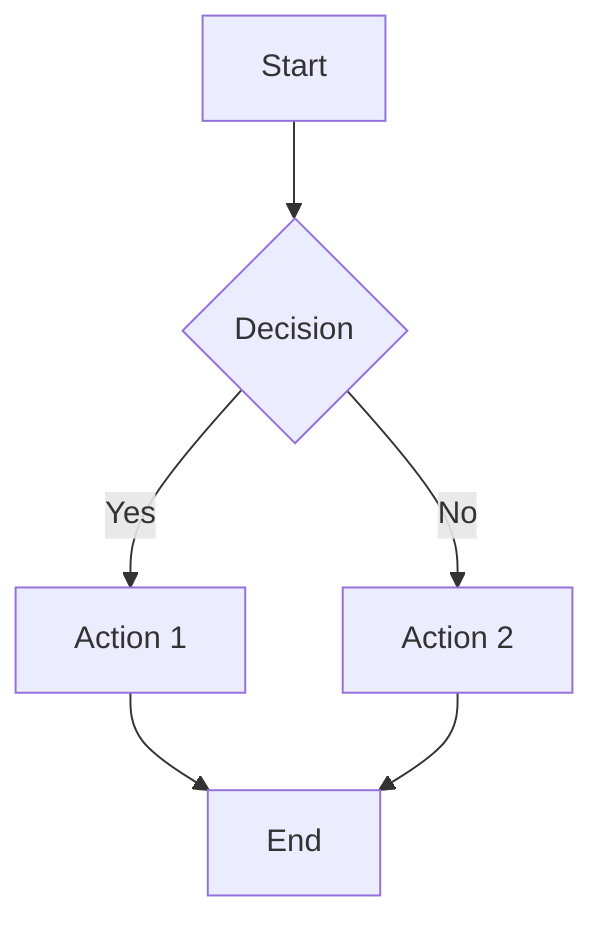

# Enhanced Study Materials

## Overview

The Enhanced Study Materials feature provides a professional note-taking experience with rich text editing, code highlighting, mathematical formulas, and diagram support. This feature is part of the Q2 2025 Learning Enhancements roadmap.

## Features

### Rich Text Editor

Built on [TipTap](https://tiptap.dev/) (ProseMirror-based), the editor provides:

- **Text Formatting**: Bold, Italic, Strikethrough, Inline Code
- **Headings**: H1, H2, H3 for document structure
- **Lists**: Bullet lists and numbered lists
- **Blockquotes**: For highlighting important information
- **Tables**: Resizable tables with headers
- **Links**: Clickable hyperlinks with custom URLs
- **Images**: Embed images via URL
- **History**: Undo/Redo support

### Code Highlighting

Powered by [Lowlight](https://github.com/wooorm/lowlight) (Highlight.js wrapper):

- **Supported Languages**: JavaScript, TypeScript, Python, Java, C#, SQL, JSON, XML, CSS, Bash
- **Syntax Themes**: GitHub-style light and dark themes
- **Code Blocks**: Fenced code blocks with language detection
- **Inline Code**: Inline `code` formatting

### Math Formulas

Using [KaTeX](https://katex.org/) for fast LaTeX rendering:

- **Inline Formulas**: `$E = mc^2$`
- **Block Formulas**: `$$\int_0^\infty f(x)dx$$`
- **Fast Rendering**: 2-3x faster than MathJax
- **Error Handling**: Graceful fallback for invalid formulas

### Diagrams

Powered by [Mermaid.js](https://mermaid.js.org/):

- **Flowcharts**: Process flows and decision trees
- **Sequence Diagrams**: System interactions
- **Class Diagrams**: UML class relationships
- **State Diagrams**: State machines
- **Gantt Charts**: Project timelines

## Usage

### Creating a Note

1. Navigate to **Enhanced Study Notes** from the sidebar
2. Click the **"New Note"** button
3. Enter a title for your note
4. Use the formatting toolbar to add content:
   - Click **Bold** (B) to make text bold
   - Click **Code** (&lt;&gt;) to insert a code block
   - Click **Table** to insert a table
   - Click **Link** to add a hyperlink
   - Click **Image** to embed an image

### Adding Code

```markdown
Use the Code Block button or type:
```javascript
function hello() {
  console.log("Hello, World!");
}
```
```

### Adding Math Formulas

For inline formulas, wrap in single dollar signs:
```
The quadratic formula is $x = \frac{-b \pm \sqrt{b^2-4ac}}{2a}$
```

For block formulas, use double dollar signs:
```
$$
\sum_{i=1}^{n} i = \frac{n(n+1)}{2}
$$
```

### Adding Diagrams

Use Mermaid syntax in a code block:
````markdown

````

## Exporting Notes

Notes can be exported in two formats:

### Markdown Export
- Plain text format with Markdown syntax
- Compatible with GitHub, Notion, Obsidian
- Preserves formatting and structure

### HTML Export
- Standalone HTML file
- Includes styles for rendering
- Can be opened in any browser

## Search and Organization

### Search
- **Full-text search**: Search across all note content
- **Real-time filtering**: Results update as you type
- **Case-insensitive**: Matches regardless of case

### Filtering
- **Category Filter**: Filter notes by certification category
- **Feature Indicators**: See which notes contain code, formulas, or diagrams
- **Word Count**: Track note length for metrics

## Success Metrics

The system tracks several metrics aligned with the roadmap success criteria:

| Metric | Target | How It's Tracked |
|--------|--------|------------------|
| Note creation rate | >5 notes per user | Count of notes per `userId` |
| Average note length | >200 words | `wordCount` field in database |
| Export usage | >20% of users | Analytics on export button clicks |
| Search effectiveness | <2 seconds | Client-side IndexedDB queries |

## Technical Details

### Data Schema

```typescript
interface StudyNote {
  id: number;
  userId: string;
  tenantId: number;
  title: string;
  content: string;              // HTML or Markdown
  richContent: JSON;            // TipTap JSON format
  contentType: 'markdown' | 'rich';
  categoryIds: number[];
  tags: string[];
  score: number | null;         // If from quiz
  wordCount: number;
  hasCode: boolean;
  hasFormulas: boolean;
  hasDiagrams: boolean;
  createdAt: Date;
  updatedAt: Date;
}
```

### Storage

- **Local Storage**: IndexedDB (client-side)
- **Cloud Storage**: Firestore (when cloud sync enabled)
- **Images**: Base64 encoded in note content (future: compressed storage)

### Performance

- **Editor Load Time**: ~500ms
- **Syntax Highlighting**: Real-time as you type
- **Math Rendering**: ~50ms per formula
- **Diagram Rendering**: ~100-300ms depending on complexity
- **Search**: <50ms for typical note collections

## Best Practices

### Note Organization

1. **Use Descriptive Titles**: "CISSP Domain 1: Security and Risk Management"
2. **Add Tags**: Helps with searching and filtering
3. **Link Related Notes**: Use hyperlinks to connect concepts
4. **Regular Exports**: Backup important notes periodically

### Content Structure

1. **Start with Headings**: Use H1 for title, H2 for sections
2. **Use Lists**: Break down complex topics into bullet points
3. **Code Examples**: Include practical code samples
4. **Formulas**: Add mathematical expressions for technical concepts
5. **Diagrams**: Visualize processes and relationships

### Study Tips

1. **Active Recall**: Write notes in your own words
2. **Spaced Repetition**: Review and update notes regularly
3. **Link to Quizzes**: Reference quiz results in your notes
4. **Export for Review**: Create HTML exports for offline study

## Troubleshooting

### Editor Not Loading
- Check browser compatibility (Chrome 90+, Firefox 88+, Safari 14+)
- Clear browser cache and reload
- Check browser console for errors

### Formulas Not Rendering
- Verify LaTeX syntax is correct
- Check for unescaped special characters
- Use KaTeX supported functions

### Code Not Highlighting
- Ensure language is specified in code block
- Check that language is in supported list
- Verify code block syntax is correct

### Diagrams Not Displaying
- Validate Mermaid syntax
- Check for syntax errors in diagram definition
- Review browser console for rendering errors

## Future Enhancements

### Planned Features (Q3-Q4 2025)

1. **Image Upload & Compression**
   - Direct image upload from device
   - Automatic compression for storage efficiency
   - Image gallery management

2. **Note Organization**
   - Folder structure for categorization
   - Nested folders support
   - Drag-and-drop organization

3. **Collaborative Features**
   - Real-time collaboration with Yjs
   - Share notes with study groups
   - Comment and annotation system

4. **AI Integration**
   - Auto-summarization of long notes
   - AI-suggested tags and categories
   - Intelligent search with semantic matching

5. **Templates**
   - Pre-built note templates
   - Custom template creation
   - Template library sharing

## API Reference

### Create Note

```typescript
const note = await storage.createStudyNote({
  userId: currentUser.id,
  tenantId: 1,
  title: "Note Title",
  content: "<p>HTML content</p>",
  richContent: editorJSON,
  contentType: "rich",
  categoryIds: [1],
  tags: ["tag1", "tag2"],
  wordCount: 150,
  hasCode: true,
  hasFormulas: false,
  hasDiagrams: false,
});
```

### Update Note

```typescript
await storage.updateStudyNote(noteId, {
  title: "Updated Title",
  content: updatedHTML,
  richContent: updatedJSON,
  updatedAt: new Date(),
});
```

### Delete Note

```typescript
await storage.deleteStudyNote(noteId);
```

### Search Notes

```typescript
const notes = await storage.getUserStudyNotes(userId, tenantId);
const filtered = notes.filter(note => 
  note.title.toLowerCase().includes(searchQuery.toLowerCase()) ||
  note.content.toLowerCase().includes(searchQuery.toLowerCase())
);
```

## Contributing

When contributing to the Enhanced Study Materials feature:

1. **Follow Code Style**: Use existing component patterns
2. **Add Tests**: Write tests for new functionality
3. **Update Docs**: Keep this documentation current
4. **Performance**: Ensure new features don't slow down the editor
5. **Accessibility**: Maintain WCAG 2.1 AA compliance

## Support

For issues or questions:

1. Check the troubleshooting section above
2. Review the [main README](../README.md)
3. Open an issue on GitHub with:
   - Browser and version
   - Steps to reproduce
   - Expected vs actual behavior
   - Screenshots if applicable

## License

This feature is part of CertLab and follows the same MIT license.
